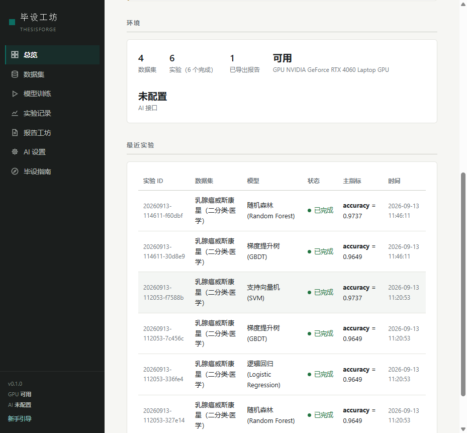
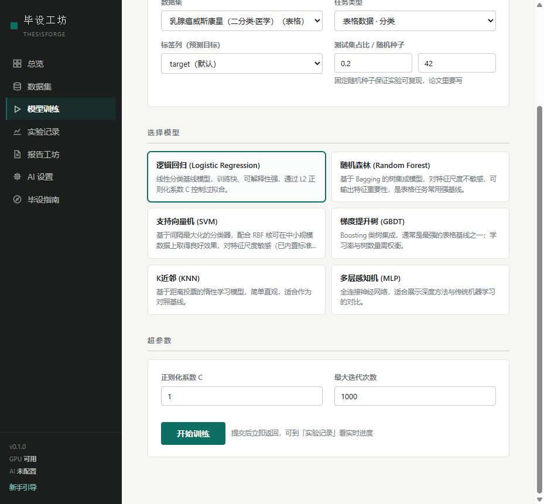
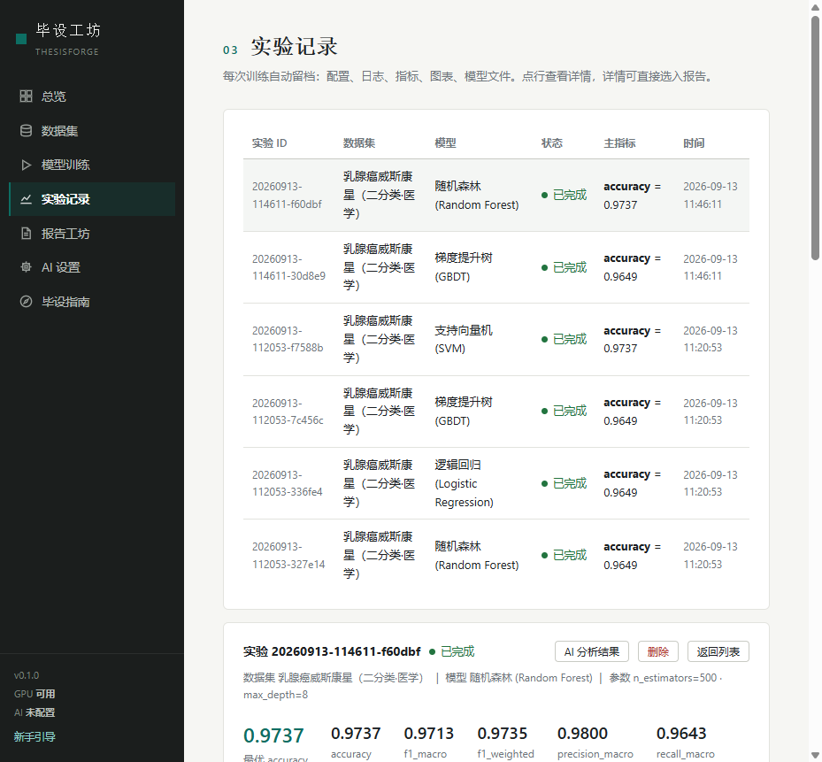
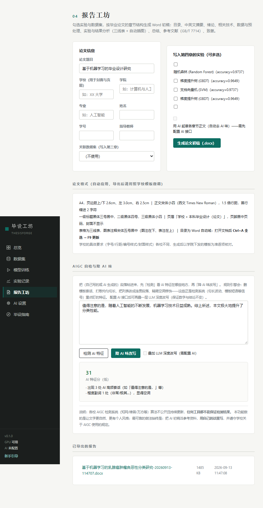

# 毕设工坊 ThesisForge

面向人工智能专业毕业设计的**一站式本地可视化工作台**：找数据集 → 表单化调参训练模型 → 实验留档对比 → AIGC 自检与降 AI 味 → 按学位论文规范一键生成 Word 初稿。全程可视化界面操作（Windows 桌面窗口或浏览器），无需写命令行。

> 纯本地运行：数据、实验记录、API Key 都只存在你自己的电脑上（`data/` 目录，已被 gitignore）。

## 界面预览

| 总览（进度清单驱动） | 模型训练（表单调参） |
| --- | --- |
|  |  |
| **实验记录（曲线/混淆矩阵/AI 分析）** | **报告工坊（论文生成 + AIGC 自检）** |
|  |  |

## 功能

- **🗂️ 数据集中心**：6 个内置经典数据集一键载入；导入本地 CSV/Excel/图像 zip；公网直链下载（带 SSRF 防护）；自动 EDA（类别分布、直方图、相关性矩阵、图像样例）+ AI 解读；自动生成缺失值、重复样本、类别分布不均、小样本、图像损坏/重复/尺寸异常等质量提醒，并同步到向导、详情页和报告；大图像数据集会按类别分层抽样体检。
- **🚀 模型训练**：28 个模型覆盖表格分类/回归、文本分类、图像分类、时间序列预测、目标检测、实例分割、像素级语义分割；表单化超参数（优化器、学习率调度、早停、梯度裁剪等）；后台子进程训练，实时日志与曲线；自动使用 GPU（CUDA），无卡自动回退 CPU。
- **📊 时间序列预测**：LSTM/GRU/Transformer 按时间顺序划分（训练段标准化、绝不随机洗牌），滑窗预测未来步数，自动生成预测曲线与真值对比图。详见[时间序列预测指南](docs/时间序列预测指南.md)。
- **🎯 目标检测与实例分割**：YOLOv8n/s、YOLOv8n/s-seg 与 RT-DETR 完整工作流——YOLO 格式数据集导入、训练、mAP50/mAP50-95/P/R 指标、混淆矩阵与预测可视化，最佳模型可直接答辩演示。详见[目标检测指南](docs/目标检测指南.md)。
- **🔍 模型解释性**：训练后自动生成任务解释图——图像用 Grad-CAM、文本用 token 梯度归因、表格 MLP 用置换重要性；失败自动跳过，不影响训练结果。详见[模型解释性指南](docs/模型解释性指南.md)。
- **🎯 自动调参**：支持 Optuna TPE 贝叶斯搜索、Hyperband 剪枝与小规模网格；每个候选都真实训练一次，结果可复现，不与普通实验混淆。详见[自动调参指南](docs/自动调参指南.md)。
- **📈 实验记录**：每个实验自动留档（配置/日志/指标/图表/模型文件），支持取消与删除，可一键重复实验或做基线消融，也可多实验对比——毕设的消融实验和对比表直接从这里出；图像任务严格按训练/验证/测试三段划分，测试集只在最终评估时使用一次。
- **🤖 AI 分析**：支持任意 OpenAI 兼容接口（DeepSeek/智谱/通义/Kimi/OpenAI）；未配置时自动降级为内置规则分析器，依然可用。
- **📝 报告工坊**：按学位论文规范生成 `.docx`——目录域、中英文摘要、五章正文、任务族文献综述、研究方法与技术路线、评价指标分析、**三线表**、自动插图、工作总结/主要结论/研究局限/未来展望、GB/T 7714 参考文献、致谢、页眉页码；AI 起草的章节自动去 AI 味。
- **🧪 AIGC 自检与降 AI 味**：检测段落中的 AI 特征（模板套话/句长均匀度/列表体）并定位问题；规则引擎 + 可选 LLM 深度改写（保持事实数字不变）。详见下方[诚实说明](#关于-aigc-功能的诚实说明)。
- **🧭 毕设向导与指南**：首次使用进入 10 步引导式操作（立项→数据→预处理→网络架构→优化策略→训练监控→评估分析→消融实验→实验对比→报告工坊），进度自动保存、随开随继续；毕设指南页另有完整路线图与[常见问题预判清单](docs/ISSUES.md)。

## 安装

### 方式一：Windows 离线整合包（推荐新手）

到 [Releases](../../releases) 下载 `ThesisForge-v0.5.1-win64-offline.zip`（无需安装 Python，解压即用）：

1. 解压到任意目录；
2. 双击 `ThesisForge.exe`（或 `启动毕设工坊.bat`），默认打开 Windows 桌面窗口（未装 WebView2 时自动改用浏览器）；
3. 首次使用会弹出新手引导，照着总览页清单做即可。

图像分类训练需要 PyTorch：双击包内 `安装图像训练-CPU版.bat`（或 `安装图像训练-GPU版.bat`，需 NVIDIA 显卡）。

不想解压也可以下载独立单文件版 `ThesisForge-v0.5.1-win-x64.exe`，双击即用（自带 Python 与表格/文本/报告全部依赖；为控制体积不含 PyTorch，图像训练请用离线整合包）。

### 启动提示与排查

- 双击后不会弹出黑色终端；单文件版需先解包（第一次启动约 5-15 秒，正常会直接出现桌面窗口）。
- 若窗口没出现或启动失败，查看 EXE 所在目录的 `data/logs/launch.log`；致命错误会附带系统弹窗提示日志位置。
- 端口 8765 被占用时程序会自动改用 8766-8785 的可用端口，实际地址以窗口标题栏下方显示为准。

### 方式二：从源码运行（Python 3.10+）

```bash
git clone https://github.com/Yihang56666-sketch/thesisforge.git
cd thesisforge
pip install -r requirements.txt
python -m app.main
# 或直接双击 start.bat（Windows）
```

想固定用浏览器打开：`python -m app.main --browser`；后台无界面运行：`python -m app.main --no-browser`。

图像训练（可选）：`pip install torch torchvision --index-url https://download.pytorch.org/whl/cu126`

### 验证安装

启动服务器后运行 `python test_e2e.py`，会自动跑通表格/文本/图像三条训练路径与报告生成。

## 快速上手（五分钟出第一组结果）

1. **数据集** 页载入「乳腺癌威斯康星」；
2. **模型训练** 页选逻辑回归 → 开始训练（基线）；
3. 再换随机森林、GBDT 各跑一次（对比）；
4. 给实验填上「基线/改进/消融」分组，**实验对比**页勾选几组实验生成对比表并导出 CSV/Markdown；
5. **实验记录** 页点开看曲线和混淆矩阵，点「AI 分析」拿改进建议；
6. **报告工坊** 勾选实验 → 生成论文初稿；打开文档后 `Ctrl+A → F9` 更新目录。

## AI 接口配置

「AI 设置」页填写 base_url + 模型名 + API Key（仅存本机 `data/runtime_config.json`），或设置环境变量：

```bash
set LLM_API_KEY=sk-xxxx        # Windows
export LLM_API_KEY=sk-xxxx     # Linux/macOS
```

| 服务商 | base_url | 模型示例 |
| --- | --- | --- |
| 智谱 AI | https://open.bigmodel.cn/api/paas/v4 | glm-4-flash（有免费额度） |
| DeepSeek | https://api.deepseek.com/v1 | deepseek-chat |
| 阿里通义 | https://dashscope.aliyuncs.com/compatible-mode/v1 | qwen-plus |
| OpenAI | https://api.openai.com/v1 | gpt-4o-mini |

## 关于 AIGC 功能的诚实说明

「降 AI 味」做的是让文字更自然、更有个人风格：删除模板套话、打散均匀句长、把列表体改成连贯段落——这些是 AI 文本检测系统（句长波动、模板短语等信号）重点利用的特征，思路参考开源中文检测项目 [HC3](https://github.com/Hello-SimpleAI/chatgpt-comparison-detection) 与 GPTZero 的 burstiness 原理。**各家检测系统（知网/维普/万方）算法不公开且持续更新，任何工具都无法保证检测结果**。最可靠的做法是把 AI 初稿当参考资料，用自己的话重写，并遵守学校关于 AIGC 使用的规定。

## 目录结构

```
thesisforge/
├── app/                 # 后端（FastAPI）
│   ├── main.py          # 路由与静态页服务
│   ├── config.py        # 路径与运行时配置（Key 脱敏、环境变量优先）
│   ├── security.py      # 出站请求 SSRF 防护（拒绝内网/保留地址）
│   ├── datasets_hub.py  # 数据集载入/导入/下载/EDA
│   ├── catalog.py       # 模型目录（参数 schema + 论文文案）
│   ├── runner.py        # 训练作业管理（子进程、取消、日志）
│   ├── train_sklearn.py # 表格/文本训练脚本
│   ├── train_torch.py   # 图像训练脚本（CNN/ResNet18 迁移学习）
│   ├── ai.py            # LLM 客户端 + 内置规则分析器
│   ├── humanize.py      # AIGC 自检 + 降 AI 味规则引擎
│   ├── plots.py         # matplotlib 中文图表
│   ├── experiments.py   # 实验分组/排序/对比表 CSV+Markdown
│   ├── desktop.py       # 桌面窗口/浏览器/无头启动与降级
│   └── report.py        # python-docx 论文生成（三线表/域/GB7714）
├── web/                 # 前端（原生 JS + SVG 图表，无构建步骤）
├── tests/               # 单元测试（路径安全/SSRF/参数清洗/报告等）
├── docs/                # 路线图 / 开源借鉴 / 问题预判 / 截图
├── data/                # 运行时数据（gitignore，含本地配置与实验记录）
├── test_e2e.py          # 端到端回归测试
└── requirements.txt
```

## 文档

- [毕设全流程路线图](docs/ROADMAP.md)
- [新手使用手册](docs/新手使用手册.md)
- [常见问题预判与对策](docs/ISSUES.md)
- [模型解释性指南](docs/模型解释性指南.md)
- [开源借鉴清单](docs/REFERENCES.md)

## 许可证

[MIT](LICENSE) — 毕设数据与论文内容版权归使用者本人。

## 致谢

依赖与设计借鉴见 [docs/REFERENCES.md](docs/REFERENCES.md)：scikit-learn、PyTorch、FastAPI、MLflow、Streamlit、HuggingFace、HC3 等优秀开源项目。
