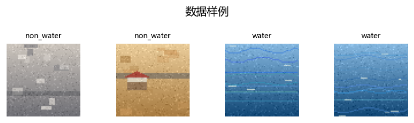

# 水面检测实验报告（合成演示数据版）

> 项目：毕设工坊 ThesisForge
> 任务：基于深度学习的水面/非水面图像二分类（非像素级分割）
> 说明：图像由脚本即时生成，用于验证“数据集 → CNN 基线 → 改进 → 对比 → 报告导出”的完整流程；**不是真实水面监控画面，不得据此得出实际工程结论**。

## 1. 数据集

- 300 张 64×64 彩色合成图，`water` 与 `non_water` 各 150 张
- `water` 类：蓝绿色渐变水面、随机波纹、阳光反光
- `non_water` 类：草地、沙地、城镇、农田、道路与简单房屋纹理
- 划分：训练 180 / 验证 60 / 测试 60，随机种子固定，测试集不参与调参



## 2. 模型与参数

| 实验 | 模型 | 优化器 | 学习率 | 轮数 | 调度 | 其他 |
| --- | --- | --- | --- | --- | --- | --- |
| 基线 | 3 层 CNN（16/32/64） | SGD | 0.01 | 6 | 无 | ReLU，Dropout=0.2 |
| 改进 | 3 层 CNN（16/32/64） | AdamW | 0.001 | 10 | 余弦 | GELU，Dropout=0.3，权重衰减 1e-4，早停 3，梯度裁剪 1.0 |

## 3. 实验结果

| 指标 | 基线-CNN-SGD | 改进-CNN-AdamW余弦 |
| --- | --- | --- |
| 测试准确率 | 1.000 | 1.000 |
| 宏平均 F1 | 1.000 | 1.000 |
| 测试损失 | 0.672 | 0.617 |
| ROC AUC | 1.000 | 1.000 |
| 训练耗时 | 6.5s | 7.0s |

## 4. 结论

1. 软件闭环验证成功：2 个深度学习实验全部由本地服务接口创建、后台训练、自动落盘，并生成对比表与 Word 报告草稿。
2. 基线与改进在合成数据上均达到 100%，符合简单演示数据预期；改进主要体现在测试损失下降（0.672 → 0.617）与训练稳定性上。
3. 合成数据类别差异明显且任务偏易，**该组数字不能代表真实水面检测难度**。真实毕设应使用公开水面/水体数据集（如水面分割、漂浮物检测、无人船视觉数据集）后按同一流程重跑。

## 5. 产物与复现

- 对比表：`docs/实验对比_水面检测.csv` / `docs/实验对比_水面检测.md`
- Word 草稿：`docs/报告草稿_基于深度学习的水面检测研究合成演示数据-20260913-231149.docx`
- 样例图：`docs/水面检测_样例图.png`

```bash
# 1. 启动服务（不开浏览器）
python -m app.main --no-browser

# 2. 跑水面检测演示实验
python scripts/run_water_surface_demo.py
```
